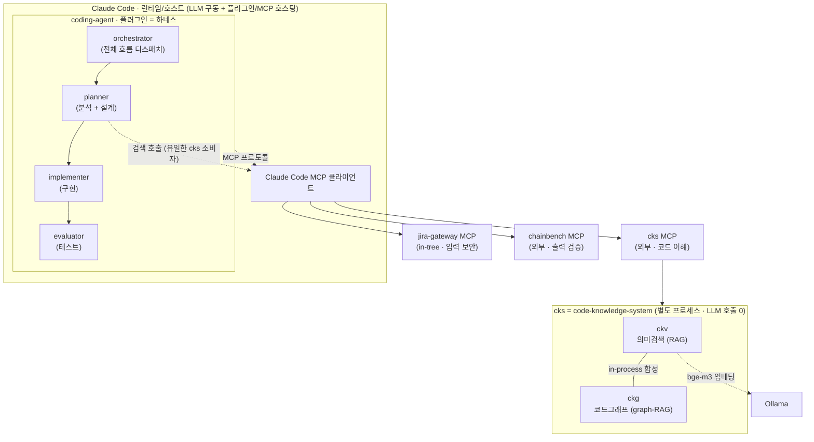
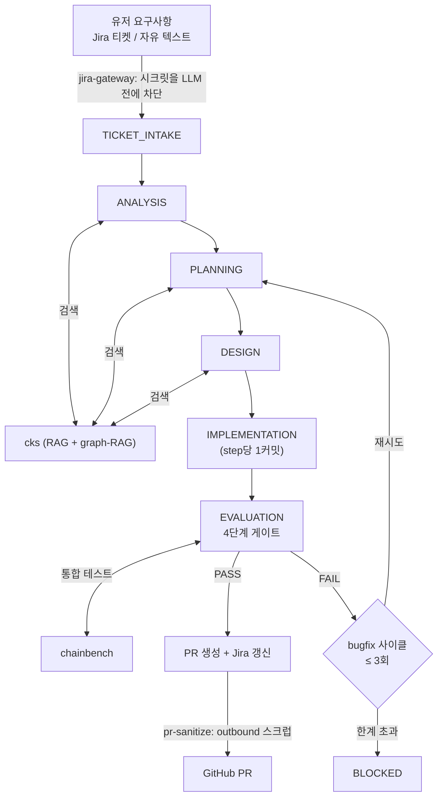
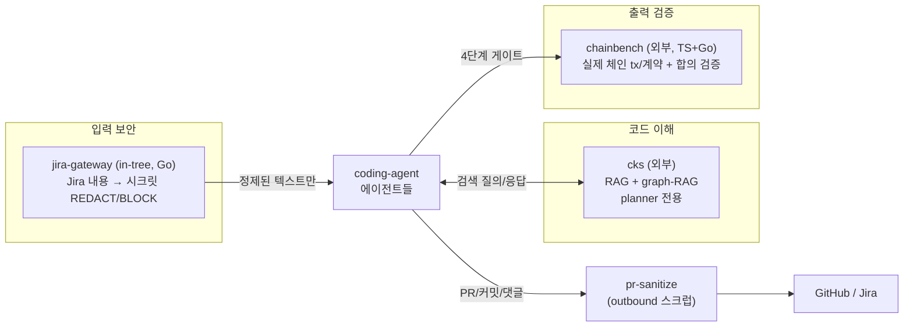

# coding-agent — 하네스 엔지니어링 기반 자율 개발 에이전트

> 이 문서는 `coding-agent`가 현재 시스템에서 어떤 역할을 하는지, 그리고 `cks`·`Claude Code`와
> 어떻게 맞물려 동작하는지를 그림 중심으로 빠르게 이해하기 위한 개요 문서다.
> 상세 빌드/설정은 [SETUP.md](SETUP.md), 설계 근거는 [../HANDOFF.md](../HANDOFF.md)와
> [r1-refactor/00-system-contract.md](r1-refactor/00-system-contract.md)를 참고.

---

## 1. 한 문장 정의

> **coding-agent**는 **하네스 엔지니어링(harness engineering)** 위에서, **cks를 통한 Retrieval(RAG)** 로
> 코드베이스를 근거 있게 이해하고, **유저의 요구사항(Jira 티켓 등)을 분석 → 설계 → 코드 구현 → 테스트 → PR**
> 까지 자율적으로 수행하는 다중 에이전트다.

여기서 "하네스 엔지니어링"이란 — LLM 하나에게 통째로 맡기지 않고, **상태 머신 + 격리된 에이전트 +
파일 산출물 + 외부 결정론 백엔드**로 작업을 구조화해서, 멈춰도 이어지고(resumable) 추측 대신
근거로 판단하게 만든 골격을 말한다.

---

## 2. 큰 그림 — coding-agent · cks · Claude Code의 관계

가장 먼저 잡아야 할 멘탈 모델: **누가 누구를 품고 있는가.**

```
┌──────────────────────────────────────────────────────────────────────────────┐
│  Claude Code  (런타임 / 호스트)                                                  │
│  · LLM(Opus/Sonnet)을 구동하는 CLI·앱                                            │
│  · 플러그인 자동 발견, 슬래시 커맨드, 에이전트, 스킬, 훅, MCP 클라이언트를 제공      │
│                                                                                │
│   ┌────────────────────────────────────────────────────────────────────────┐ │
│   │  coding-agent  (Claude Code 플러그인 = "하네스")                           │ │
│   │  · /work /analyze /review /merge /status /bench  슬래시 커맨드             │ │
│   │  · orchestrator / planner / implementer / evaluator  4개 에이전트         │ │
│   │  · state.json + *.md 산출물로 된 문서 기반 상태 머신                        │ │
│   │                                                                          │ │
│   │        planner 가 검색을 위해 호출 ──┐                                     │ │
│   └──────────────────────────────────────┼───────────────────────────────────┘ │
│                                          │ (MCP 프로토콜)                        │
│         Claude Code의 MCP 클라이언트가 중개 │                                       │
│   ┌──────────────────┬───────────────────┼──────────────────┐                  │
│   ▼                  ▼                    ▼                  ▼                  │
│ ┌────────────┐  ┌──────────┐      ┌──────────────┐                            │
│ │jira-gateway│  │   cks    │      │  chainbench  │   ← MCP 서버 3종            │
│ │ (in-tree)  │  │ (외부)   │      │   (외부)      │                            │
│ └────────────┘  └────┬─────┘      └──────────────┘                            │
└─────────────────────┼──────────────────────────────────────────────────────┘
                      │  cks 내부 (별도 프로세스/저장소, LLM 호출 0 = 결정론)
                      ▼
            ┌───────────────────────────────────┐
            │  cks = code-knowledge-system       │
            │   ┌─────────┐   ┌─────────┐        │
            │   │   ckv   │ + │   ckg   │        │  in-process로 합성
            │   │ 의미검색  │   │ 코드그래프 │       │
            │   │ (RAG)   │   │(graph-RAG)│      │
            │   └────┬────┘   └─────────┘        │
            │        │ bge-m3 임베딩 (Ollama)      │
            └────────┴──────────────────────────┘
```

**같은 관계를 Mermaid로:**



**세 줄 요약**

- **Claude Code** = 무대(런타임). LLM을 돌리고 플러그인/MCP를 호스팅한다.
- **coding-agent** = 그 무대 위에서 도는 **플러그인이자 하네스**. 일을 단계로 쪼개고 에이전트에게 나눠준다.
- **cks** = coding-agent가 **MCP로 호출하는 외부 검색 두뇌**. 코드베이스를 RAG로 이해하게 해준다.

> 관계의 핵심: coding-agent는 cks를 *포함*하지 않는다. cks는 **별도 저장소·별도 프로세스**이고,
> Claude Code의 MCP 클라이언트를 통해 **호출**될 뿐이다. 그래서 cks가 죽거나 degraded여도
> coding-agent는 멈추지 않는다(검색 품질만 낮아진다).

---

## 3. 동작 흐름 — 요구사항이 PR이 되기까지

```
                              ┌─────────────────────────────────────────────┐
   유저 요구사항               │              coding-agent (하네스)             │
  ┌──────────────┐            │                                               │
  │  Jira 티켓    │  inbound   │   ┌─────────────┐                            │
  │  STABLE-1234 │──필터링────▶│   │ orchestrator│ ◀── 전체 흐름을 보는 유일한 두뇌 │
  │  (또는 자유    │  (시크릿     │   └──────┬──────┘                            │
  │   텍스트)     │   차단)     │          │ 상태 전이로 에이전트 디스패치          │
  └──────────────┘            │          ▼                                    │
        ▲                     │  ┌───────────────────────────────────────┐   │
        │ jira-gateway MCP    │  │ ANALYSIS → PLANNING → DESIGN           │   │
        │ (민감정보가 LLM에    │  │   ▲ planner (요구사항 분석 + 설계)       │   │
        │  닿기 전에 차단)     │  │   │                                     │   │
        │                     │  │   │  ┌──────────┐                       │   │
        │                     │  │   └──│  cks MCP  │◀── Retrieval (RAG)    │   │
        │                     │  │      │ (검색두뇌) │   의미검색 + 그래프검색  │   │
        │                     │  │      └──────────┘                       │   │
        │                     │  │            ▲                            │   │
        │                     │  │            │ "이 코드 어디서 호출돼?       │   │
        │                     │  │            │  뭘 깨뜨려? 동시성 위험은?"     │   │
        │                     │  │  IMPLEMENTATION  (implementer: step당 1커밋)│   │
        │                     │  │       │                                 │   │
        │                     │  │       ▼                                 │   │
        │                     │  │  EVALUATION  (evaluator: 4단계 게이트)    │   │
        │                     │  │       │   unit+race · lint · security ·  │  │
        │                     │  │       │   chainbench(통합) ◀─ chainbench MCP │
        │                     │  │       ▼                                 │   │
        │                     │  │   PASS ─────────────▶ PR 생성 + Jira 갱신 │  │
        │                     │  │   FAIL ─▶ bugfix 사이클(≤3) 또는 BLOCKED  │   │
        │                     │  └───────────────────────────────────────┘   │
        │                     │                                               │
        └─────────────────────│──── outbound 텍스트(PR/커밋/댓글)             │
              pr-sanitize로     │      → pr-sanitize 스크럽 후 외부로           │
              outbound도 차단    └─────────────────────────────────────────────┘
                                                       │
                                                       ▼
                                              ┌──────────────┐
                                              │  GitHub PR   │
                                              └──────────────┘
```

**같은 흐름을 Mermaid로:**



---

## 4. 두 개의 기둥

### 기둥 A — 하네스: "문서 기반 상태 머신"

LLM의 컨텍스트는 언제든 잘릴 수 있다. 그래서 **모든 단계가 산출물을 디스크에 남긴다.**

```
  ANALYSIS  ──▶  analysis.md      ┐
  PLANNING  ──▶  plan.md          │  세션이 끊겨도
  DESIGN    ──▶  design-v{N}.md   ├─ 파일에서 정확히
  EVALUATION──▶  test-report.md   │  이어받음 (resumable)
  (전 단계) ──▶  state.json       ┘
```

그리고 일을 **4개의 격리된 에이전트**로 나눈다 — 각자 자기 컨텍스트만 보고, orchestrator만 전체를 본다.

| 에이전트 | 하는 일 |
|---|---|
| **orchestrator** | 상태 전이 디스패치, MCP pre-flight, PR/Jira 완료, 버그 사이클 재진입 |
| **planner** | 요구사항 **분석 + 설계** — cks를 쓰는 유일한 에이전트 |
| **implementer** | 코드 **구현** (원자 step당 1커밋) |
| **evaluator** | **테스트** (4단계 검증 게이트) |

### 기둥 B — Retrieval: "cks를 통한 RAG"

planner는 낯선 거대 코드베이스(`go-stablenet`)를 **추측하지 않는다.** 대신 cks에 물어봐서
**실제 코드에 근거**한 설계를 한다.

```
   planner의 질문                cks (RAG 엔진)              근거 있는 답
  ─────────────────         ┌───────────────────┐       ─────────────────
  "이 요구사항과 관련된  ──▶  │ ① 의미 검색 (RAG)  │  ──▶   관련 함수/파일 목록
   코드가 어디지?"            │   bge-m3 임베딩     │
                            │                    │
  "이 함수 고치면     ──▶   │ ② 그래프 검색       │  ──▶   호출자/피호출자 그래프,
   뭐가 깨지지?"             │   (graph-RAG)      │        영향 범위, 동시성 위험
                            │   호출그래프·영향분석 │
                            └───────────────────┘
```

이게 바로 일반 RAG와 같은 원리다 — **검색으로 가져온 근거를 컨텍스트에 넣어 LLM이 환각 없이 판단**하게
만드는 것. 다만 텍스트 의미검색(RAG)에 더해 **코드 호출 그래프(graph-RAG)** 까지 합성한다는 점이 특징이다.

---

## 5. MCP 3종 — 에이전트의 손과 발

coding-agent가 외부와 상호작용하는 통로는 (Claude Code의 MCP 클라이언트를 거치는) MCP 서버 3개이고,
역할이 깔끔하게 나뉜다.

```
   ┌────────────────┐   ┌────────────────┐   ┌────────────────┐
   │  jira-gateway  │   │      cks       │   │   chainbench   │
   │   (입력 보안)   │   │  (코드 이해)    │   │   (출력 검증)   │
   ├────────────────┤   ├────────────────┤   ├────────────────┤
   │ Jira 내용을     │   │ RAG + graph-RAG │   │ 실제 체인 띄워  │
   │ 가져오되 시크릿  │   │ 으로 코드 검색   │   │ tx/계약 보내고  │
   │ 을 LLM 전에     │   │ (planner 전용)  │   │ 합의 검증       │
   │ REDACT/BLOCK    │   │                 │   │ (evaluator 게이트)│
   └────────────────┘   └────────────────┘   └────────────────┘
      이 저장소 in-tree      외부 sibling repo     외부 sibling repo
         (Go)               (bge-m3 임베딩)        (TS+Go)
```

**같은 역할 분담을 Mermaid로:**



> **설계 원칙 — Binary = deterministic, Session = LLM**
> 외부 백엔드(cks·chainbench) 바이너리는 LLM 호출이 **0**이다. 임베딩·그래프·테스트 실행 같은
> **결정론적 작업만** 담당하고, 모든 *판단(LLM)* 은 coding-agent 세션 레이어에 모인다.
> 그래서 같은 입력이면 백엔드는 항상 같은 결과를 준다.

> **보안은 양방향 대칭**
> 입력은 jira-gateway가 LLM에 닿기 *전에* 막고(`shared/patterns.json` 정규식+엔트로피),
> 출력(PR 본문·커밋·Jira 댓글)은 `pr-sanitize`가 같은 패턴으로 스크럽한 뒤 내보낸다.

에이전트가 쓸 수 있는 도구 표면(총 26개)은 [`contract/agent-mcp.schema.json`](../contract/agent-mcp.schema.json)에
고정(SSoT)되고, [`contract/lint-tool-names.sh`](../contract/lint-tool-names.sh)로 drift를 검출한다.

---

## 6. 진입점 (슬래시 커맨드)

| 명령 | 의미 |
|---|---|
| `/coding-agent:work STABLE-1234` | 메인. 요구사항 → PR 풀 사이클 (`--local`로 Jira 없이도 가능) |
| `/coding-agent:analyze "..."` | 자유 텍스트 요구사항으로 시작 (Jira 불필요) |
| `/coding-agent:review <PR>` | PR 리뷰 코멘트를 받아 bugfix 사이클 재진입 |
| `/coding-agent:merge` | **main을 건드리는 유일한 명령** — 승인+green일 때만 squash merge |
| `/coding-agent:status` | 진행 상황 조회 |
| `/coding-agent:bench` | A(cks)/B(code-only)/C(code+skills) 3-way 정보 regime 비교 harness |

---

## 7. 핵심을 한 번 더

```
  ┌─ 하네스 엔지니어링 ─┐   상태 머신 + 격리 에이전트 + 파일 산출물 → 멈춰도 이어짐
  │                    │
  │  coding-agent      │   ┌─ cks Retrieval (RAG) ─┐   추측 대신 실제 코드 근거로 설계
  │   (Claude Code      │   │                        │
  │    플러그인)        │   └─ 요구사항(Jira) 분석 ──┘ → 설계 → 구현 → 테스트 → PR
  └────────────────────┘                                              (자율 수행)
```

요구사항 한 줄을 넣으면, 검색으로 코드를 이해하고, 설계 문서를 쓰고, 커밋 단위로 구현하고,
4단계로 검증한 뒤, 리뷰된 PR로 돌려주는 — **"읽고 추측하는 AI"가 아니라 "근거를 검색해 일하는
엔지니어링된 에이전트"** 다.

- **Claude Code**가 무대를 깔고,
- **coding-agent**가 그 위에서 일을 구조화하며,
- **cks**가 그 일에 필요한 코드 근거를 RAG로 공급한다.
